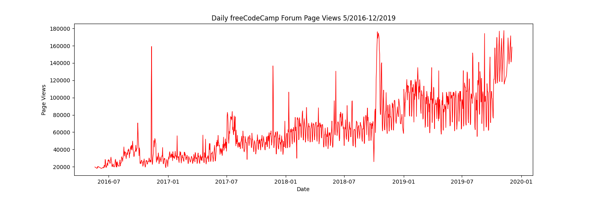
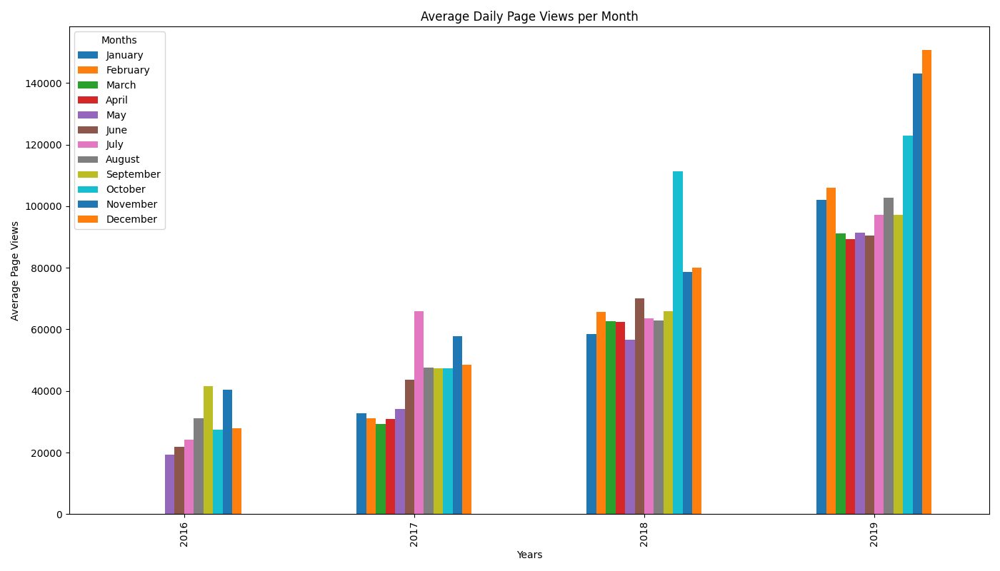

# Page-View-Time-Series-Visualizer

# freeCodeCamp Time Series Visualizer
This project is part of the freeCodeCamp Data Analysis with Python Certification. It involves visualizing time series data from the freeCodeCamp forum to identify patterns and trends over time using Python, Pandas, Matplotlib, and Seaborn.

# Project Structure
fcc-forum-pageviews.csv        # Input dataset
time_series_visualizer.py      # Main logic for visualization
main.py                        # Script to run the plots
test_module.py                 # Unit tests provided by freeCodeCamp
README.md                      # Project description
line_plot.png                  # Saved output: Line Plot
bar_plot.png                   # Saved output: Bar Plot
box_plot.png                   # Saved output: Box Plot

# Visualizations
This project generates the following plots:

Line Plot:
Shows daily page views from May 2016 to December 2019.

Bar Plot:
Displays average daily page views for each month, grouped by year.

Box Plots:
Year-wise Box Plot (Trend)
Month-wise Box Plot (Seasonality)

# How to Run
1. Clone the repository and install dependencies:
pip install -r requirements.txt

2. Run the visualizations:
python main.py

3. Run the tests:
python test_module.py

# Requirements
Place the dataset fcc-forum-pageviews.csv in the root directory.
Required Libraries:
pandas
matplotlib
seaborn

# Install them using:
pip install pandas matplotlib seaborn

# Unit Tests
Tests check the correctness of:
Data cleaning
Plot labels
Plot titles

# OutPut Plots 
## Line Plot

## Bar Plot

## Box Plots

